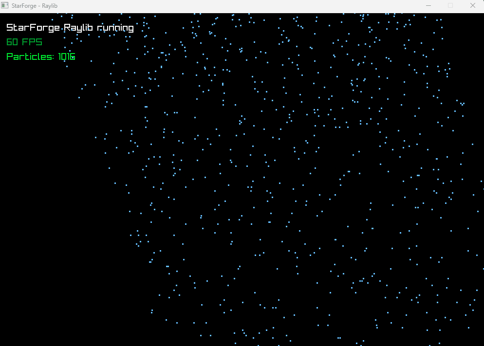

# StarForge

Low-level, modular particle simulation engine written in pure C, focused on data-oriented design, memory layout optimization and performance benchmarking.
Starforge is an experimental particle system designed to explore AoS vs SoA data layouts, SIMD-friendly update loops, while remaining portable and minimal.

## Live Demos (Raylib Frontend)

### Fire + Smoke


### Rain


Supported features:

- Continuous emitters (Rain, Fire & Smoke)
- Event-based emitters (Burst / Explosions)
- ASCII frontend
- Raylib frontend
- Portable build using CMake (Linux, Termux, Windows)

---

## Build Status


---

## Requirements

### Termux / Linux
`pkg install clang cmake make git`

### Ubuntu
`sudo apt install clang cmake make git`

### Windows
Visual Studio with CMake

---

## Build (CMake)

```
git clone https://github.com/RunningBrute/starforge.git
cd starforge
```

### Termux / Linux

```
mkdir build 
cd build
cmake ..
make
```

### Windows

```
mkdir build
cd build
cmake -G Ninja ..
ninja
```

---

## Run demos

```
Rain demo:
./starforge_demo_rain

Burst / Explosion demo:
./starforge_demo_burst
```

---

## Run tests

```
./starforge_tests
```

---

## Benchmarks

### Test environment

- CPU: 16 cores @ 2.4 GHz
- Cache:
  - L1 Data: 32 KiB (per core)
  - L1 Instruction: 32 KiB (per core)
  - L2 Unified: 256 KiB (per core)
  - L3 Unified: 16 MiB (shared)
- OS: Windows 11 x64
- Compiler: MSVC
- Build type: Release
- Compiler flags: `/O2 /arch:AVX2`
- Benchmark framework: Google Benchmark

### Results

| Benchmark | Time [ms] | Speedup vs AoS |
|---------|-----------|----------------|
| AoS     | 5.66      | 1.0x           |
| SoA     | 1.81      | 3.1x           |
| AVX2    | 1.84      | 3.0x           |

### Running benchmarks

```bash
cmake -S . -B build -DCMAKE_BUILD_TYPE=Release
cmake --build build --config Release
./build/starforge_benchmark.exe
```

---

## Project structure

`include/`        - Engine API  
`src/`            - Core engine, emitters and frontends  
`demos/`          - Showcase applications  
`tests/`         - Unit tests (Unity)  
`build/`          - CMake build output  

---

## Termux support

StarForge builds and runs directly on Android using Termux with Clang and CMake.

---
