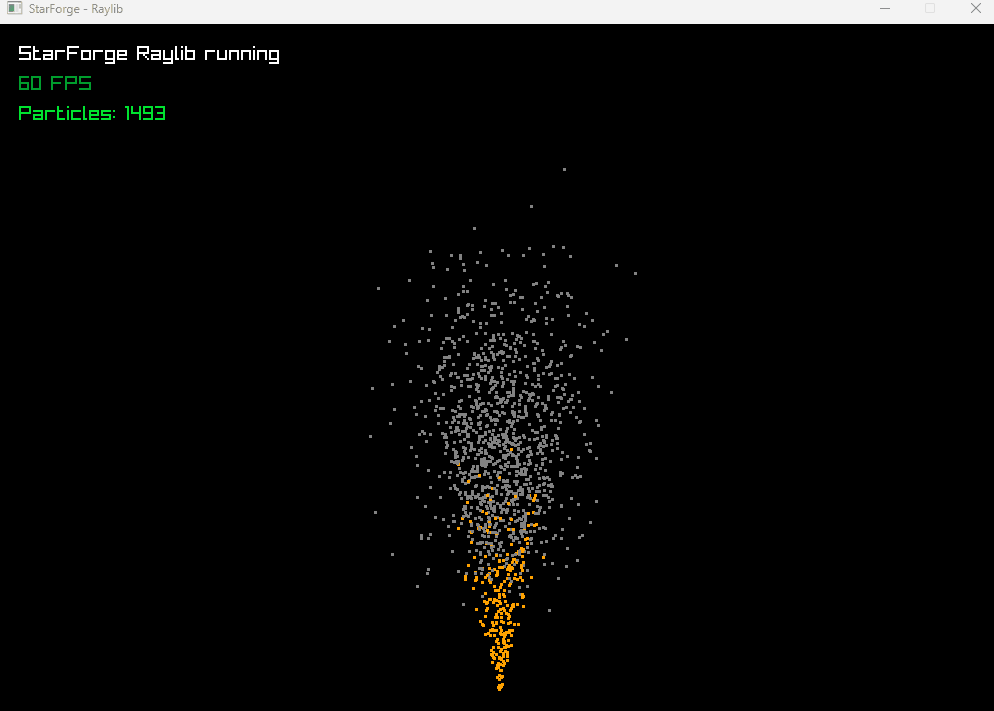
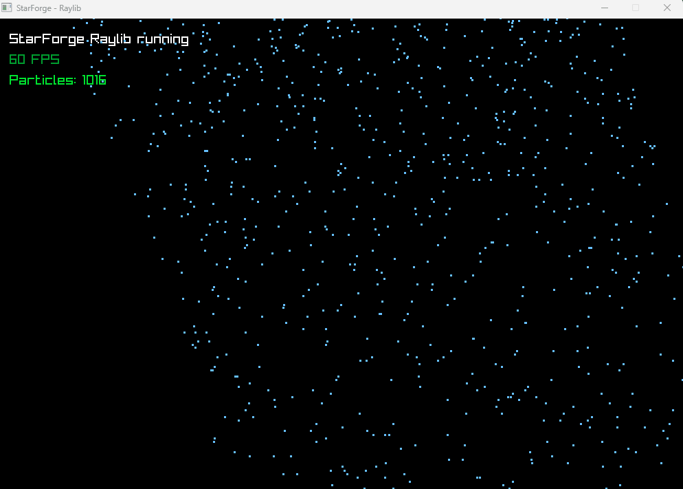

# StarForge

Low-level, modular particle simulation engine written in pure C, focused on data-oriented design, memory layout optimization and performance benchmarking.
Starforge is an experimental particle system designed to explore AoS vs SoA data layouts, SIMD-friendly update loops, while remaining portable and minimal.

## Live Demos (Raylib Frontend)

### Fire + Smoke


### Rain


Supported features:

- Continuous emitters (Rain, Fire & Smoke)
- Event-based emitters (Burst / Explosions)
- ASCII frontend
- Raylib frontend
- Portable build using CMake (Linux, Termux, Windows)

---

## Build Status


---

## Requirements

### Termux / Linux
`pkg install clang cmake make git`

### Ubuntu
`sudo apt install clang cmake make git`

### Windows
Visual Studio with CMake

---

## Build (CMake)

```
git clone https://github.com/RunningBrute/starforge.git
cd starforge
```

### Termux / Linux

```
mkdir build 
cd build
cmake ..
make
```

### Windows

```
mkdir build
cd build
cmake -G Ninja ..
ninja
```

### Build configuration options

Starforge supports multiple build-time configuration options to adapt to different platforms and performance requirements.

#### SIMD support (AVX2)
SIMD backends are optional and disabled automatically on unsupported architectures (e.g. ARM).

```
cmake -DSTARFORGE_ENABLE_SIMD=ON ..
```

To disable SIMD explicitly:

```
cmake -DSTARFORGE_ENABLE_SIMD=OFF ..
```

When disabled, Starforge falls back to the portable CPU backend.

#### Termux / Android build

Starforge can be built and run on Termux (Android) using a dedicated compatibility mode.

```
cmake -DSTARFORGE_USE_TERMUX=ON ..
```

This option:
- disables unsupported compiler flags and platform-specific assumptions
- ensures compatibility with the Termux toolchain
- allows development and testing directly on Android devices

By default, Termux support is disabled.

---

## Run demos

```
Rain demo:
./starforge_demo_rain

Burst / Explosion demo:
./starforge_demo_burst
```

---

## Run tests

```
./starforge_tests
```

---

## Benchmarks

Starforge benchmarks compare different data layouts and backends using **identical workloads** across platforms.  
The goal is to evaluate the impact of **data-oriented design (AoS vs SoA)** and **SIMD** on real hardware.

Benchmarks are implemented using **Google Benchmark** and measure the average time per update.

---

### Test environments

#### Desktop (x86_64)

- CPU: 16 cores @ 2.4 GHz
- Cache:
  - L1 Data: 32 KiB (per core)
  - L1 Instruction: 32 KiB (per core)
  - L2 Unified: 256 KiB (per core)
  - L3 Unified: 16 MiB (shared)
- OS: Windows 11 x64
- Compiler: MSVC
- Build type: Release
- Compiler flags: `/O2 /arch:AVX2`
- SIMD: AVX2 enabled

#### Mobile (ARM / Termux)

- Device: Motorola Edge
- CPU: 8 × 2.2 GHz
- OS: Android (Termux)
- Compiler: Clang
- Build type: Release
- SIMD: disabled

---

### Results — Desktop (Windows)

| Backend        | Time [ms] | Speedup vs AoS |
|----------------|-----------|----------------|
| AoS            | 5.66      | 1.0×           |
| SoA            | **1.81**  | **3.1×**       |
| SoA + AVX2     | 1.84      | 3.0×           |

---

### Results — Mobile (Termux / Android)

| Backend | Time [ms] | Speedup vs AoS |
|--------|-----------|----------------|
| AoS    | 4.72      | 1.0×           |
| SoA    | **1.37**  | **3.4×**       |

---

### Notes

- Benchmarks measure **average time per iteration**, not total runtime.
- All benchmarks use the same workload and update logic across platforms.

---

## Project structure

`assets/`     - Demo files
`benchmarks/` - Google Benchmark tests
`external/`   - external libs (Google Benchmark)
`include/`    - Engine API  
`src/`        - Core engine, emitters and frontends  
`demos/`      - Showcase applications  
`tests/`      - Unit tests (Unity)  
`build/`      - CMake build output  

---
